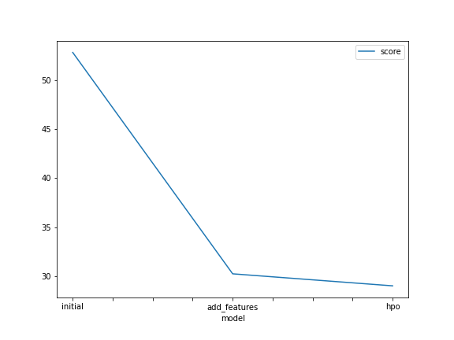
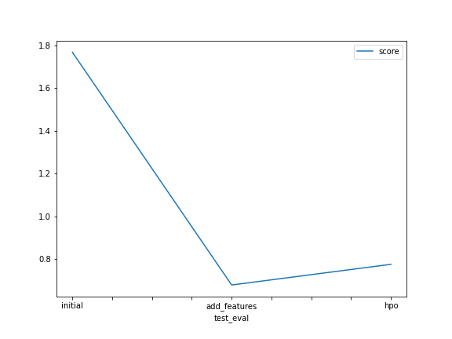

# Report: Predict Bike Sharing Demand with AutoGluon Solution
#### Austin Chu

## Initial Training
### What did you realize when you tried to submit your predictions? What changes were needed to the output of the predictor to submit your results?
The predictions from the output of the predictor follow a regression line so there is potential for negative values, which does not make sense given we are predicting bike share demand. Therefore, it was required to change any negative prediction values to zero. However, for my case, there happened to be no negative value predictions.

### What was the top ranked model that performed?
The model that performed the best was the WeightedEnsemble_L3 model after I feature engineered some datetime related features.

## Exploratory data analysis and feature creation
### What did the exploratory analysis find and how did you add additional features?
Through exploratory data analysis, I realized the easiest feature to add would be converting the single datetime feature into multiple features related to year, month, day, and weekday.

### How much better did your model preform after adding additional features and why do you think that is?
The model performed significantly better, with a RMSE of 30 vs the original 50+. This makes sense intuiitively because bike share demand is likely highly correlated with the day of the week and also the month.

## Hyper parameter tuning
### How much better did your model preform after trying different hyper parameters?
Honestly, the model performed worse after my attempts at tuning hyper parameters. I attempted to tune the general hyper parameters for AutoGluon TabularPredictor instead of specific model type hyper parameters. I then realized the hyper parameters I was tuning were overwriting the presets='best_quality' hyper parameters.

### If you were given more time with this dataset, where do you think you would spend more time?
I would take the time to standardize/normalize the continuous features, so their variation is more influential on the prediction results vs just sheer magnitude. I would also take the time to specifically tune the hyperparameters of the top performing models.

### Create a table with the models you ran, the hyperparameters modified, and the kaggle score.
|model|hpo1 num_stack_levels|hpo2 num_bag_folds|hpo3 num_bag_sets|score|
|--|--|--|--|--|
|initial|1|8|20|1.76720|
|add_features|1|8|20|0.67915|
|hpo|1|5|1|0.77584|

### Create a line plot showing the top model score for the three (or more) training runs during the project.

### Create a line plot showing the top kaggle score for the three (or more) prediction submissions during the project.

## Summary
I used AutoGluon's TabularPredictor to try and predict bike share demand. The initial model without any features engineered was used as a benchmark and performed poorly. Simply adding features derived from datetime siginificantly increased performance. This shows how important feature engineering can be. I believe even more improvement can be made from standardizing/normalizing the continuous features. This can be done in future iterations of this project. Hyperparameter tuning for AutoGluon can be tricky. Specifying hyperparameters for specific model types takes a lot of knowledge and time. Trying to only tune TabularPredictor hyperparamters can actually worsen the outcome compared to presets='best_quality'. Removing the time_limit makes it take way longer to train and results did not improve. Overall was a good learning experience, and I hope to learn more about and become more proficient at AutoGluon hyper parameter tuning. 
